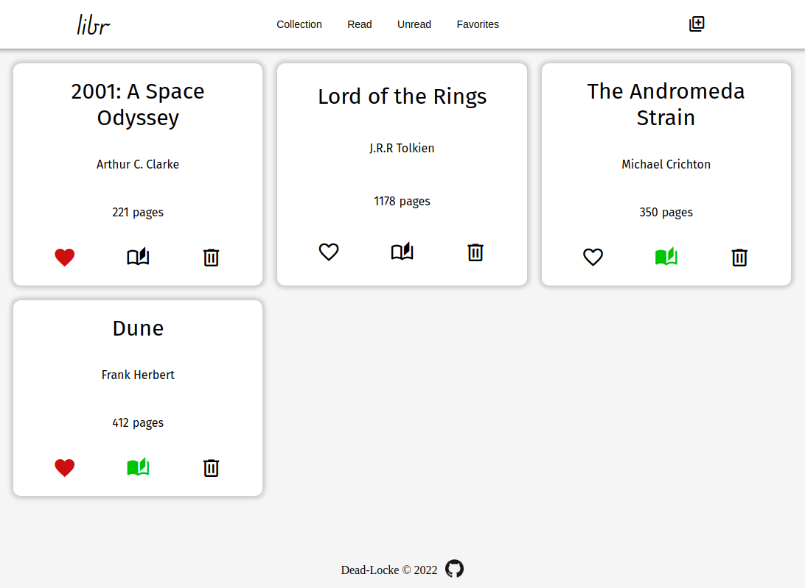

# Project: A Library
## Sixth? major project from the [Odin Project](https://www.theodinproject.com/lessons/node-path-javascript-library) carriculum.
---

---
This is a small library app that builds upon the object, object constructors and inhertiance section of The Odin Project. 
## Check it out [here!](https://dead-locke.github.io/library-project/)
---
### Goals/Features:
- [x] Display all books stored in the users library
- [x] Allow users to favorite any book 
- [x] Allow ability to toggle read and unread status of a book. 
- [x] Pop up form for adding a new book to the library.
- [x] Ability to delete any book from the library.
- [x] Filters for read, unread, and favorite books. 
- [x] Displays a count for each status and total count of books in library.  

---

### Learning Outcomes: 
- Learned how to intergrate objects into a website and utilize object properties and methods with javascript.  
- Learned how to create and structure a modal form that overlays the entire screen. 

---
### Future features:
- [ ] Incorporate local storage for the contents of the library.  
- [ ] Dark/Light Mode. 
- [ ] Search Functionality
- [ ] Sorting by Author/Title in alphabetical order.